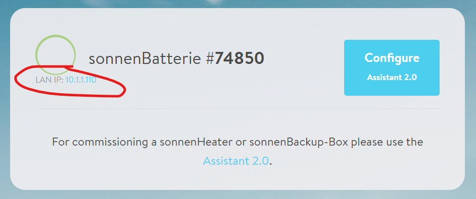

# Sonnen Batterie - ChargHq Integration

This integration allows smart charging of your EV with [Sonnen Solar Batterie](https://sonnen.com.au/) and [ChargeHq](https://chargehq.net/).

I have decided to use Microsoft .Net7 for this integration, but it would also be quite easy to port to other environments.

## Setup

If running as .Net7 service update the [appsettings.json](./service/appsettings.json) with your relevant urls and keys and compile to your target
platform:

```json
  "Sonnen": {
    "BaseUrl": "http://localhost"
  },
  "ChargeHq": {
    "BaseUrl": "https://api.chargehq.net",
    "ApiKey": "YourApiKey",
    "RefreshMs":"120000" //optional- defaults to 2 mins
  }

```

### Getting your Sonnen local address

- Open [https://find-my.sonnen-batterie.com/](https://find-my.sonnen-batterie.com/) on the local LAN. This page shows your local Sonnen IP address:



- Use this as your BaseUrl in the Sonnen configuration setting.

### Getting your ChargeHq API key

- Log into [https://app.chargehq.net/](https://app.chargehq.net/).
- Click settings
- Select "My Equipment" -> Solar battery equipment.
- Select the "Push Api" item.
- Copy your API key into the ChargeHq ApiKey setting.

More details can be found here. [https://chargehq.net/kb/push-api](https://chargehq.net/kb/push-api).

## Docker

If you want to run a docker container, they you can use the [publish.sh](./service/publish.sh) script to create a linux build/docker image.

### Exporting the docker image

To export the docker image, execute the [export.sh](./service/export.sh) script to add a tar archive in the [./service/dist](./service/dist/)
directory. I use this to run the container on my Synolgy NAS.

### Environment Settings

If using docker, add the following docker environment Variables for your configuration:

```docker
Sonnen__BaseUrl=http://your_local_sonnen_address
ChargeHq__ApiKey=Your_Api_Key

```
